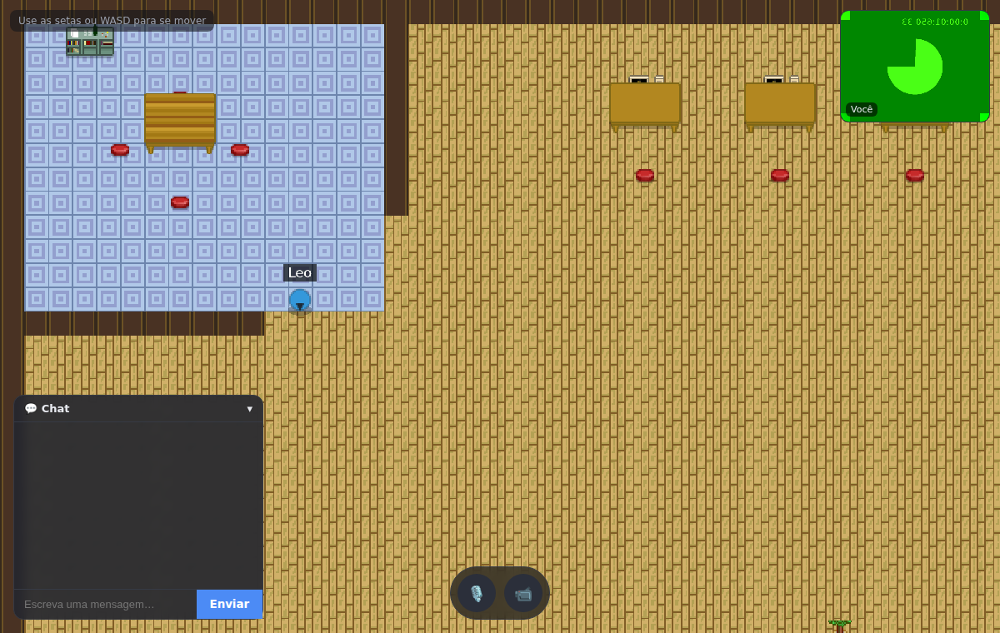

# Guther 🎮

Um **espaço virtual 2D multiplayer** no estilo do [Gather](https://www.gather.town/):
avatares andam por um mapa em tempo real e conversam por **vídeo/áudio por
proximidade** — a câmera/microfone de outra pessoa liga automaticamente quando o
avatar dela chega perto do seu.



## Funcionalidades

- 🗺️ **Mundo 2D com tilemap** — piso, paredes e obstáculos com colisão; a câmera
  segue o seu avatar.
- 🕹️ **Movimento** — setas ou **WASD**, com indicador de direção.
- 👥 **Multiplayer em tempo real** — veja outras pessoas entrarem, se moverem e
  saírem instantaneamente, com o nome acima de cada avatar.
- 🎥 **Vídeo/áudio por proximidade (WebRTC)** — ao se aproximar de outro jogador,
  a conexão é estabelecida e os vídeos aparecem; ao se afastar, a conexão é
  encerrada.
- 💬 **Chat de texto** em tempo real.
- 🎙️ **Controles** de microfone e câmera.

## Stack (a mesma do Gather)

| Camada | Tecnologia |
|---|---|
| Renderização do jogo 2D | [Phaser 3](https://phaser.io/) |
| UI / app shell | React 18 + TypeScript + Vite |
| Tempo real | [Socket.IO](https://socket.io/) |
| Vídeo/áudio | WebRTC (`RTCPeerConnection`, topologia *mesh*) |
| Backend | Node.js + Express + Socket.IO |

## Estrutura

```
server/   → estado do mundo em memória + sinalização WebRTC (Socket.IO)
client/   → React + Vite + Phaser (jogo, UI, rede)
```

O contrato de eventos entre os dois vive em `server/src/protocol.ts` e
`client/src/net/protocol.ts` (mantidos idênticos).

## Como rodar

Requisitos: **Node.js 18+**.

### 1. Servidor

```bash
cd server
npm install
npm run dev        # sobe em http://localhost:3001
```

### 2. Cliente

Em outro terminal:

```bash
cd client
npm install
npm run dev        # abre em http://localhost:5173
```

Abra **duas abas** em `http://localhost:5173`, entre com nomes diferentes e
mova-se com as setas/WASD. Aproxime os avatares para ligar o vídeo.

> **Câmera/microfone:** o navegador só libera `getUserMedia` em contexto seguro
> (`localhost` ou HTTPS). Em `localhost` funciona direto; ao hospedar, use HTTPS.

### Variáveis de ambiente

**Servidor**
- `PORT` — porta do servidor (padrão `3001`).
- `CLIENT_ORIGIN` — origem permitida no CORS (padrão `*`).

**Cliente**
- `VITE_SERVER_URL` — URL do servidor Socket.IO (padrão:
  `http://<host>:3001`).

## Build de produção

```bash
cd server && npm run build && npm start
cd client && npm run build            # gera client/dist (estático)
```

## Deploy (um clique no Render)

O jeito mais simples: **um único serviço** no Render que serve o site **e** o
servidor de tempo real (Socket.IO/WebRTC) na mesma origem. Você recebe **uma
URL**, que já é o app completo — sem configurar variáveis. O `render.yaml` já
está no repositório.

1. Em [render.com](https://render.com): **New → Blueprint** e conecte este
   repositório. O Render lê o `render.yaml`, builda o `client/` e o `server/` e
   sobe um único serviço web.
2. Ao final você terá uma URL, ex.: `https://guther.onrender.com` — **é o seu
   escritório**. Abra em duas abas (ou compartilhe) para testar. 🎉

> ⚠️ **Por que não a Vercel?** A Vercel é serverless e **não hospeda servidores
> WebSocket persistentes**, que o tempo real exige. Por isso o deploy padrão é o
> Render (ou qualquer host com WebSocket: Railway, Fly.io…).

> 💤 No plano gratuito do Render o serviço "dorme" após inatividade — a primeira
> visita pode levar ~50s para acordar.

### Alternativa: frontend na Vercel + servidor no Render

Se quiser servir o frontend pela Vercel (o `vercel.json` já builda o `client/`),
defina na Vercel a variável `VITE_SERVER_URL` com a URL do serviço do Render. No
Render, defina `CLIENT_ORIGIN` com a URL da Vercel para restringir o CORS.

> **WebRTC entre redes diferentes:** o app usa apenas um servidor **STUN**
> público. Em muitas redes reais (NAT restrito) isso não basta e o vídeo pode
> não conectar — nesse caso é preciso um servidor **TURN**
> (ex.: [Twilio](https://www.twilio.com/stun-turn),
> [Metered](https://www.metered.ca/tools/openrelay/) ou um `coturn` próprio),
> adicionando-o em `ICE_SERVERS` (`client/src/net/webrtc.ts`).

## Arquitetura

O servidor mantém as posições dos jogadores **em memória** (uma sala única) e,
a cada movimento, recalcula quem está dentro do **raio de proximidade**
(`PROXIMITY_RADIUS`, em `protocol.ts`). Quando esse conjunto muda, ele envia um
evento `nearby-update` para o cliente afetado, que **abre** ou **fecha** as
conexões WebRTC correspondentes. O servidor atua apenas como **servidor de
sinalização** (repasse de offer/answer/ICE); a mídia trafega P2P (mesh).

## Limitações e próximos passos

- **Mesh WebRTC** é ideal para grupos pequenos. Para muitos participantes por
  sala, o próximo passo é um **SFU** (ex.: [mediasoup](https://mediasoup.org/)).
- Estado do mundo é **em memória** e há **uma sala única**. Evoluções naturais:
  múltiplas salas, persistência, áreas privadas ("private spaces") e volume do
  áudio proporcional à distância.
- O **mundo é pixel art** (piso, paredes e móveis de um escritório). Os
  **avatares** ainda são círculos simples — próximo passo natural é trocá-los por
  personagens em pixel com animação de caminhada, para coerência total.

## Créditos dos assets

Os tiles do escritório (piso, paredes e móveis em `client/public/assets/office/`)
foram recortados dos tilesets do projeto open-source
**[Tuxemon](https://github.com/Tuxemon/Tuxemon)**, licenciados sob
**[CC BY-SA 4.0](https://creativecommons.org/licenses/by-sa/4.0/)**. Crédito aos
autores do Tuxemon; obras derivadas devem manter a mesma licença (share-alike).
